# OCRProject

## Overview
The OCR (Optical Character Recognition) Project is designed to process images, extract meaningful text data, and perform image preprocessing for better OCR accuracy. This project leverages Tesseract for optical character recognition and includes a modular pipeline for processing images, extracting text, and organizing output data into structured formats. The solution is built in .NET and provides flexibility for OCR tasks such as extracting text from various document formats.

## Features
- Reads image files
- Uses OCR to extract text
- Outputs recognized text to  file
- Generates Embeddings for extracted Text
- Calculates cosine similarity
- Tracks time taken by each processing step
- Tracks memory usage
- Computes the best processing model based on cosine similarity, time taken by processing step and memory usage
- Captures all the logging trace in Text file.

## Prerequisites
- .NET SDK (latest version recommended)
- Visual Studio or any C# IDE
- Tesseract OCR library 
- OpenAI library
- Tessdata

## Installation and Usage Instructions
Step 1- Clone the project from git using git clone command, Link clone Project-https://github.com/Taibaz-Pathan/ocr-techtitans.git      
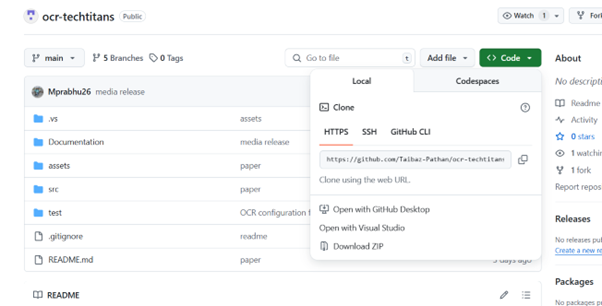  
Figure1. Git Clone of Project 

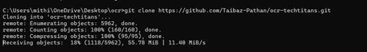 
Figure2. Cmd image of Project getting cloned 

Step 2- Go to project folder. Use command cd OCRProject
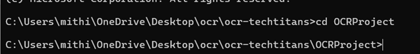 
Figure3. Navigate to project folder

Step 3- Install dependencies. Use dotnet restore to install dependencies. OCRProject.csproj file already mentions the required dependencies to be installed 
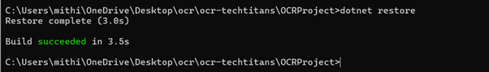 
Figure4. Installation step 

Step 4-Build the project after the dependencies are installed. Use dotnet build command.  
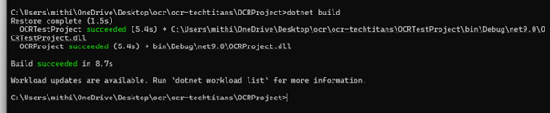 
Figure5. Build Project  

Step 5- Open Input folder to place your input-images. The project already has few images. \ocr-techtitans\OCRProject\Input 
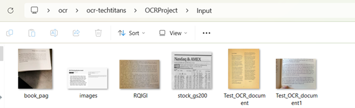 
Figure6. Input Image folder 

Step 6- Go to Utils folder- \ocr-techtitans\OCRProject\Utils 
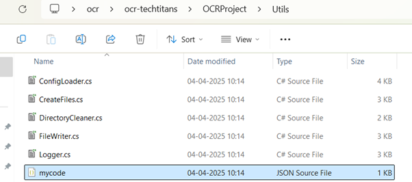 
Figure7. Utils folder 

Step 7- Open mycode.json and place your open ai chatgpt key  
Replace “YOUR-API-KEY” with actual api key 
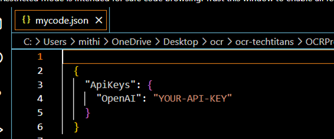 
Figure8. Replace with your key 

Step 8- To open the project code, import the working directory in visual studio or click on OCRProject.sln 
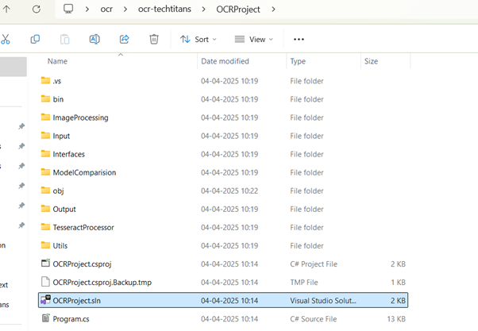 
Figure9. Replace with your key 

Step 9- To run the project click on Green arrow in Visual Studio 
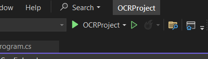 
Figure10. Visual Studio button 

or Go to \OCRProject\bin\Debug\net9.0 and execute/double click on OCRProject.exe  
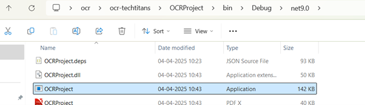 
Figure11. OCRProject.exe file  

You will see these message once you run 
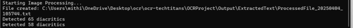 
Figure12. Code getting executed

Once the code is executed, you will see below message 
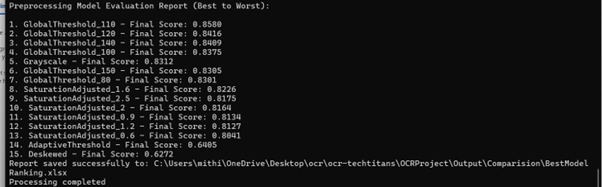 
Figure13. Code execution completion message

Step 10- Check the output folder for the results.  
Folder OCRProject\Output\Comparision- Contains 3 excel files. 
BestModelRanking.xlsx – contains the models ranked from best to worstCosineSimilarity.xlsx- Contains the cosine matrix generated 
ProcessingResults.xlsx- Contains time taken by each preprocessing step and memory usage metrics 
Folder OCRProject\Output\ExtractedText- Contains one text file with all the extracted texts 
Folder OCRProject\Output\ Logs- Contains one text file which ia alog file that captures any warning/error message. File name is AppLog.txt  
Folder \OCRProject\Output\ProcessedImage- Contains all the images generated after applying preprocessing  

## Project Structure
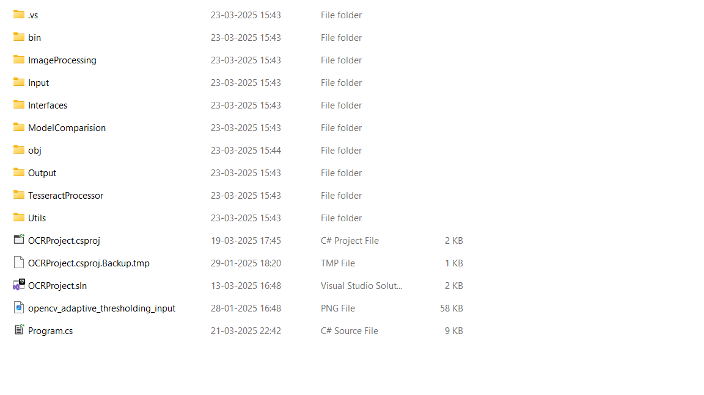
Figure14. Project File Structure
- `OCRProject.csproj`: Project configuration file.
- `Program.cs`: Main entry point of the application.
- `Input/`: Folder containing input image files.
- `Output/`: Folder for saving processed images and extracted text.
- `ModelComparison/`: Folder for storing model comparison results and embeddings.
- `ImageProcessing/`: Folder for image preprocessing scripts.
- `TesseractProcessor/`: Folder for handling text extraction via Tesseract.
- `Utils/`: Folder for utility scripts.

## Project Workflow
The OCR Project follows a pipeline for each input image through several steps: 
1. Image Preprocessing 
Input: Raw image (e.g png, jpg, jpeg etc). Raw images are to be store in Input Folder 
Process: Different pre-processing techniques are applied to the input image to remove noise, remove blurring or image and obtain a clean image. Preprocessing class     are store in ImageProcessing folder.Following are the preprocessing techniques used: 
- ConvertToGrayscale- Converts a color image to grayscale by reducing it to shades of gray, simplifying the data for better OCR accuracy. 
- Deskew.cs- Corrects any tilt or rotation in the image, aligning the text horizontally to improve OCR results. 
- GlobalThresholding.cs- Converts the grayscale image into a binary image (black and white) by applying a global threshold, improving contrast for text detection. 
- SaturationAdjustment.cs- Adjusts the saturation of the image to enhance color intensity, which can help with clarity in certain image types. 
- AdaptiveThreshold.cs- SConverts the image based on local threshold and variation in brightness 

2. Text Extraction (OCR)
Input: Pre-processed image (obtained from the previous step-stored in folder Output/ProcessedImage). 
Process:  
Utilize Tesseract OCR to extract text from the image. 
Tesseract processes the image and generates raw text based on detected characters. 
Output: Extracted text is stored in the text file by Name- ProcessedFile_yyyyMMdd_HHmmss.txt (example-ProcessedFile_20250323_154732). File is stored in Output/ ExtractedText. The extracted text is also stored in a dictionary.

3. Generate Embeddings 
Input: A dictionary of extracted Texts, where keys are model names and values are the extracted texts. 
Process: Random embeddings (vectors) for extracted texts is generated by EmbeddingGeneratorService.cs. The service is stored in ModelComparision folder. 
Output: Structured output in the desired format, typically as text files, CSV, or JSON. 

4. Cosine Similarity Calculation: The generated embeddings are compared using the cosine similarity method to measure the similarity between different preprocessing approaches. The results of cosine similarity matrix are stored in Output/Comparison folder by name CosineSimilarity.xlsx. 

5. Time Tracking and memory usage- While we apply preprocessing technique and extract text using Tessearct we calculate the time taken by each processing step and the memory usage of that pre processing step. The results are the stored in Output/Comparison folder by name ProcessingResults.xlsx. 

6. Ranking the preprocessing- Based on results of cosine similarity, time taken by pre-processing method and memory usage-each pre processing step is ranked from high to low order and is store in Output/Comparison folder by name BestModelRanking.xlsx 

## Dependencies
Required Libraries 
The following libraries are required to run the OCR project. You can install these dependencies via NuGet. 

For OCR Processing: 
using System; 
using System.IO; 
using SixLabors.ImageSharp; 
using SixLabors.ImageSharp.PixelFormats; 
using SixLabors.ImageSharp.Processing; 
using SixLabors.ImageSharp.Formats.Png; 
using Tesseract; 

For Image Preprocessing: 
using System; 
using SixLabors.ImageSharp; 
using SixLabors.ImageSharp.PixelFormats; 
using SixLabors.ImageSharp.Processing;  
using System.Linq; 

For Configuration & Utilities: 
using System; 
using System.IO; 
using System.Reflection; 
using System.Collections.Generic; 
using System.Linq; 
using System.Text; 
using System.Threading.Tasks; 

For Cosine similarity and Conversion to matrix: 
using System; 
using System.Collections.Generic; 
using System.IO; 
using System.Linq; 
using NPOI.SS.UserModel; 
using NPOI.XSSF.UserModel; 
using OCRProject.Interfaces; 
using System.Diagnostics; 

## Unit test Project
https://github.com/Taibaz-Pathan/ocr-techtitans/tree/main/src/OCRTestProject 

## Steps to run Unit test 
Step 1- Import the UnitTest Project in Visual Studio. OCRProjectE2ETests.cs contains all the end to end unit tests 
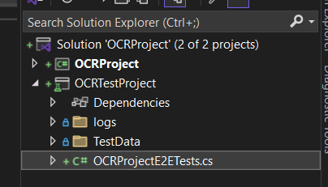 
Figure15. Unit test Folder 

Step 2- To run the unit tests, go to Tests tab and click on Run All Tests 
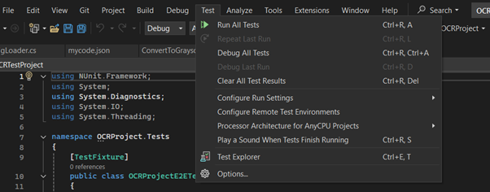 
Figure16. Run tests

Step 3- After running the test, you will see if the tests failed or passed 
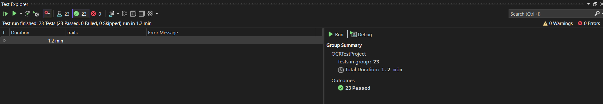 
Figure17. Unit test results 